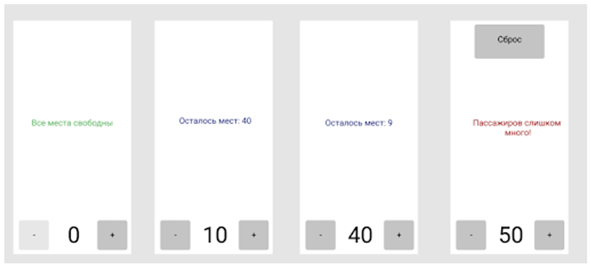
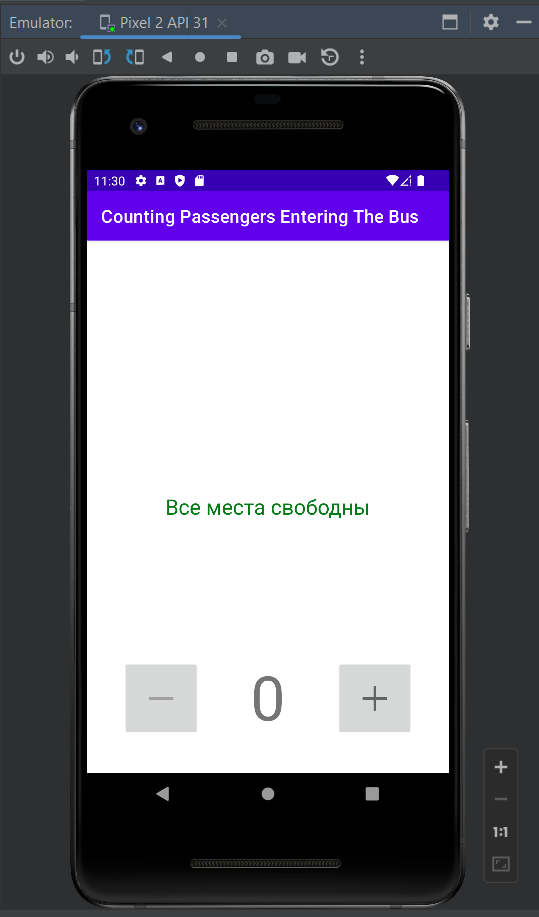
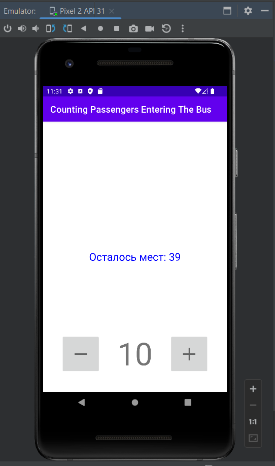
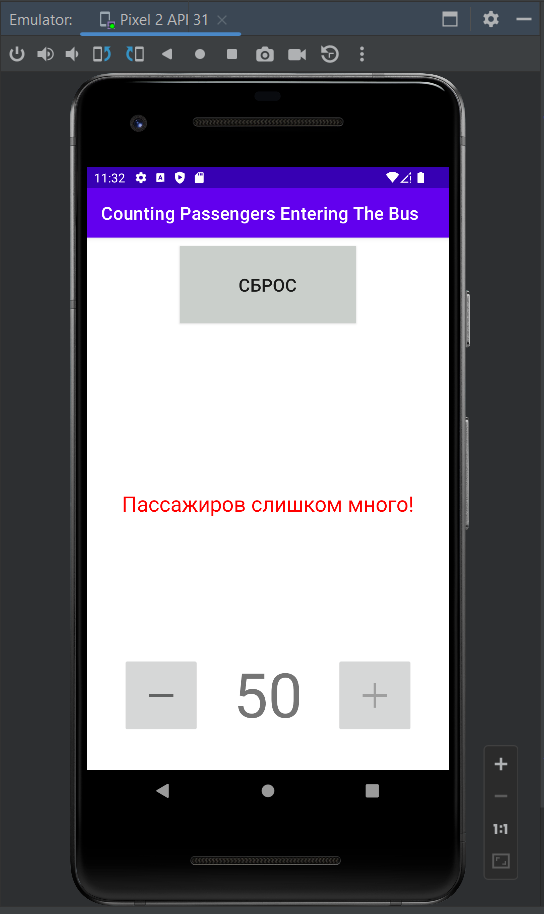

# Андроид разработчик.

## Урок 1. Начало работы.

Цель практической работы:
Закрепить знания по текстовым полям и кнопкам.

Что нужно сделать:

Необходимо разработать небольшое приложение-счетчик для подсчета пассажиров, входящий в автобус.
Приложеие должно иметь следующий вид:

* Нажатие кнопок "+" и "-" изменяет значение счетчика и текстовых полей на "+1" и "-1" соответственно. 
Задавать значение меньше 0 нельзя.
* Кнопка "Сброс" не только сбрасывает счетчик, но и возвращает приложение в первоначальное состояние (скриншот 1).
* В автобусе 49 сидячих мест. Мы хотим отправлять автобусы максимально наполненными, но допускать превышения нельзя. 
Слишком большое количество пассажиров - это повод для немедленного отправления.
* Если все места свободны, текст по середине - зеленый, кнопка "-" недоступна.
* При количестве пассажиров от 1 до 49 текст синий, кнопки доступны. Кнопка "сброс" невидимая.
* При количестве пассажиров 50 и выше текст красный, появляется кнопка "Сброс".

## Демонстрация решения:

